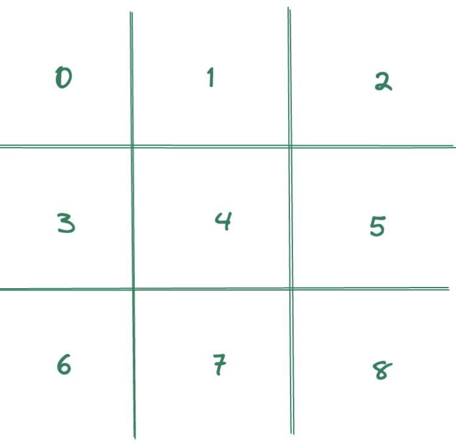

# TicTacToe

This is an implementation of the game TicTacToe



## How to play
1. build application locally by running ``mvn clean install``
2. Start the Spring boot application.
3. Create at least 2 players using this request 
    ```
   curl --location --request POST 'http://localhost:8080/v1/player' \
    --header 'Content-Type: application/json' \
    --data-raw '{"name": "Bob"}' 
    ```
   
4. Create a new game using this request
   ```
   curl --location --request POST 'http://localhost:8080/v1/game' \
    --header 'Content-Type: application/json' \
    --data-raw '{
    "player1":<PLAYER1_ID>,
    "player2":<PLAYER2_ID>
    }'
   ```
   
5. Use the ``v1/game/makeMove`` endpoint to make moves as following
    ```
   curl --location \
    --request POST 'http://localhost:8080/v1/game/makeMove?gameId=<GAME_ID>&position=<POSITION_ON_BOARD>' \
    --header 'playerId: <CURRENT_PLAYER_ID>'
    ```
